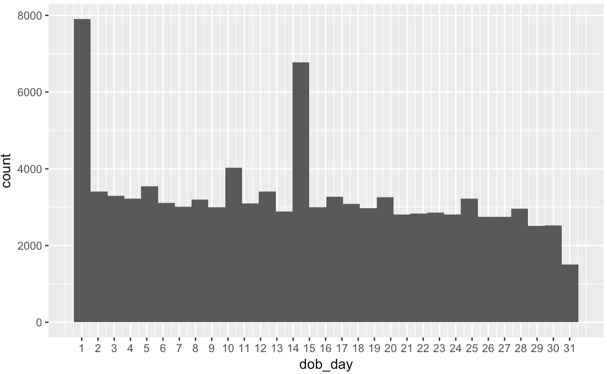

# Udacity Data Analyst Nano Degree

## Part 3: Exploratory Data Analysis

> Keep curious and skeptical about data, test and develop intuitions of data

### Basic Commands

- `c()` — vector object, containing arguments

  - ```R
    numbers <- c(1:10)
    numbers <- c(numbers, 11:20)
    ```

- `nchar()` — count the number of each characters

  - ```R
    udacious = c("Chris Saden", "Lauren Castellano", "Sarah Spikes")
    mystery = nchar(udacious)
    ```

- Subsetting

  - ```R
    udacious[mystery == 11]
    ```

- `data()` — load data

- `str()` — feature names and their types, like `info()` in Pandas

- `summary()` — quantile info, like `describe()` in Pandas

- `table()` — counts of unique values, like `value_counts()` in pandas

- `levels()` — unique values, like `unique()` in pandas

  - ```R
    # Order the unique values for plotting
    # ses is a factor (categorical feature) containing low, mid and high
    ses.order <- ordered(ses, levels = c("low", "middle", "high"))
    
    # Alternative
    ses.order <- factor(ses, levels = c("low", "middle", "high"), ordered = T)
    ```

- `dim()` — size of R object

- `names()` — output all variable names in dataset

- `row.names()` — get and rename variable names

  - ```R
    row.names(mtcars)
    row.names(mtcars) <- c(1:32)  # rename
    ```

- `head()` — first 5 rows

- `tail()` — last 5 rows

- `$` — display particular variable

  - ```R
    mtcars$cyl
    ```

- `mean()` — average

- `rm()` — remove objects from workspace

- `getwd()` and `setwd()` — show and edit work dir

- `?[any command]` — help doc of command

### Loading & Subsetting DataFrame

- `read.csv()` — read csv file

- `subset(dataframe, ROWS, select = COLUMNS)` 

  - where COLUMNS can be `-name` as reverse expression 

- `dataframe[ROWS, COLUMNS]` 

  - ```R
    # dataframe: stateinfo
    stateinfo[stateinfo$state.region == 2, ]
    # equals to below
    subset(stateinfo, state.region == 2)
    ```

- Logical operator

  - `&` for AND
  - `|` for OR

PS: [Subsetting](https://www.statmethods.net/management/subset.html)

### Markdown in R

- RMD file —> through Knit HTML —> generate HTML file including the result of embedded R codes

  - ```R
    # Integrate R code by
    ​```{r}
    # r 块中的哈希或英镑符号会创建
    # 注释。这三行不是代码，因此不能被 # 执行。
    x <- [1:10]
    mean(x)
    ​```
    ```

### ggplot2

#### Single Variable

- Histogram

  - ```R
    qplot(x = dob_day, data = pf) + 
      scale_x_continuous(breaks=1:31)  # update x axis by creating a new layer
    ```

  - 

- Facet

  - ```R
    # Facet with one addtional variable
    qplot(x = dob_day, data = pf) + 
      scale_x_continuous(breaks=1:31) +
      facet_wrap(~dob_month, ncol = 3)  # this is the line
    # Facet with two addtional variables
    qplot(x = dob_day, data = pf) + 
      scale_x_continuous(breaks=1:31) +
      facet_grid(dob_month~gender)  # this is the line
    ```

- Subset without NA

  - ```R
    # Subsetting with condition of a column
    subset(pf, !is.na(gender))
    ```

- Descriptive summary of data

  - ```R
    # Target value: friend_count
    # Group by: gender
    # Run function: summary
    by(pf$friend_count, pf$gender, summary)
    ```

- Update label of axis

  - ```R
    qplot(x = tenure/365, data = pf, binwidth = 0.25,
          color = I('black'), fill = I('#099DD9'),
          ylab = 'Number of users in sample') + # using inline
      scale_x_continuous(breaks = 1:7, limits = c(0,7)) + 
      xlab('Number of years using Facebook') # using layer
    ```

- Multiple plots in one output 

  - ```R
    # using gridExtra
    p1 = qplot(x = friend_count, data = pf)
    p2 = p1 + scale_x_log10()  # trasnform to become normal distribution, which is assumed by most models
    # and for skewed data, log transform always work
    p3 = p1 + scale_x_sqrt()
    
    grid.arrange(p1,p2,p3, ncol=1)
    ```

- Comparison between distribution

  - ```R
    # using frequency polygon
    qplot(x = friend_count, y = ..count../sum(..count..), 
          data = subset(pf, !is.na(gender)),
          xlab = 'Friend Count',
          ylab = 'Proportion of Users with that Friend Count',
          binwidth = 10,
          geom = 'freqpoly',
          color = gender) + 
      scale_x_continuous(limits = c(0,1000), breaks = seq(0,1000,100))
    ```

  - 

- Boxplot

  - ```R
    qplot(x = gender, y = friend_count,
          data = subset(pf, !is.na(gender)),
          geom = 'boxplot') + 
      coord_cartesian(ylim = c(0,1000))  # zoom coordinate without removing data points
    # while scale_y_continuous will remove data points
    ```


#### Two Variables

- In ggplot syntax

  - ```R
    ggplot(aes(x = age, y = friend_count), data = pf) + 
      geom_point() + 
      xlim(c(13,90))
    ```

- Solution of overplotting

  - ```R
    ggplot(aes(x = age, y = friend_count), data = pf) + 
      geom_jitter(alpha = 1/20) +  # jitter + transparent
      xlim(c(13,90))
    ```

- Transform axis after statistics (plotting)

  - ```R
    ggplot(aes(x = age, y = friend_count), data = pf) + 
      geom_point(alpha = 1/20) + 
      xlim(c(13,90)) + 
      coord_trans(y = 'sqrt')  # transform after statistics, so may bend line to curve; while scale_y_sqrt transforms data before statistics
    ```

- Plot summarized result by manipulating data

  - ```R
    pf.fc_by_age = pf %>%  # %>% to chain functions
      group_by(age) %>%
      summarise(fc_mean = mean(friend_count),
                fc_median = median(friend_count),
                n = n()) %>%
      arrange(age)
    
    ggplot(aes(x = age, y = fc_mean), data = pf.fc_by_age) + 
      geom_line()
    ```

  - 

- Plot summarized result on top of raw data plot

  - ```R
    ggplot(aes(x = age, y = friend_count), data = pf) + 
      geom_jitter(alpha = 1/20,
                  position = position_jitter(h = 0),
                  color = 'orange') + 
      xlim(c(13,90)) + 
      coord_trans(y = 'sqrt') + 
      geom_line(stat='summary', fun.y = mean) + 
      geom_line(stat='summary', fun.y = quantile,
                fun.args = list(probs = 0.9),
                linetype = 2,
                color = 'blue') +
      geom_line(stat='summary', fun.y = median,
              color = 'blue') + 
      geom_line(stat='summary', fun.y = quantile,
              fun.args = list(probs = 0.1),
              linetype = 2,
              color = 'blue')
    ```

  - 

- Pearson correlation

  - ```R
    cor.test(pf$age, pf$friend_count, method = 'pearson')
    # or
    with(pf, cor.test(age, friend_count, method = 'pearson'))
    
    # Thumb rules
    # <0.3 no meaningful correlation
    # ~0.3 small
    # ~0.5 moderate
    # >=0.7 strong
    ```

- Correlation line on top of raw data plot

  - ```R
    ggplot(aes(x = www_likes_received, y = likes_received), data = pf) + 
      geom_point() + 
      xlim(0, quantile(pf$www_likes_received, 0.95)) + # remove outlier
      ylim(0, quantile(pf$likes_received, 0.95)) + # remove outlier
      geom_smooth(method = 'lm', color = 'red')
    ```

  - 

- Bias and variance trade-off

  - ```R
    p1 = ggplot(aes(x = age, y = fc_mean), data = subset(pf.fc_by_age, age<71)) + 
      geom_line()
    
    p2 = ggplot(aes(x = age_with_months, y = friend_count_mean), data = subset(pf.fc_by_age_months, age_with_months<71)) + 
      geom_line()
    
    p3 = ggplot(aes(x = round(age/5)*5, y = friend_count), data = subset(pf, age<71)) + 
      geom_line(stat = 'summary', fun.y = mean)  # round function removes info between each age
    
    grid.arrange(p1,p2,p3, ncol = 1)
    ```

  - 

#### Three Variable

- Devide by color

  - ```R
    ggplot(aes(x = age, y = median_friend_count), data = pf.fc_by_age_gender) +
      geom_line(aes(color = gender))
    ```

  - 

- Reshape and unpivot

  - ```R
    library(reshape2)
    
    pf.fc_by_age_gender.wide = dcast(pf.fc_by_age_gender,
                                     age ~ gender, # keep age and split gender from one column to female and male column
                                     value.var = 'median_friend_count') # use median as value in female and male column
    ```

- Cut / Bucket discrete variable

  - ```R
    pf$year_joined.bucket = cut(pf$year_joined,
                                c(2004,2009,2011,2012,2014)) # only need to state the beginning year of each bucket
    ```

- Smooth noisy plot (have to consider bias-variance trade-off on visualization)

  - ```R
    ggplot(aes(x = tenure, y = friendships_initiated / tenure),
           data = subset(pf, tenure > 0)) +
      geom_smooth(aes(color = year_joined.bucket))
    ```

  - 

- 

----

### Reference:

1. 