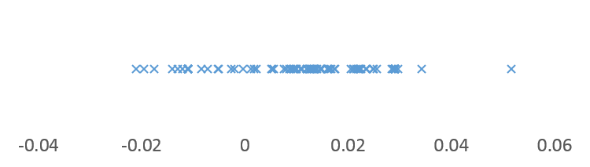
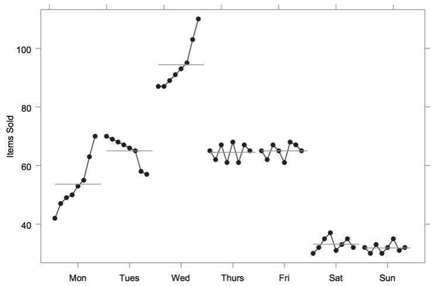

# Udacity Data Analyst Nano Degree

[TOC]

## Part 4: Storytelling with Data

### Fundamental Data Visualization

[Anscombe's quartet:](https://en.wikipedia.org/wiki/Anscombe%27s_quartet)

[Gapminder: Wealth & Health of Nations](https://www.gapminder.org/tools/#$locale$id=en;&chart-type=bubbles) 

###Design Principles

#### Choosing Chart Type

> Visual Encodings + Data Types + Relationship = Chart Types
>
> Eg: x-axis, y-axis and points + continuous data + y related to x = scatter plot

- **Histogram:** need to consider binwidth to detect normality
- **Box plot:** need more data, and hard to detect normality
- **Violin plot:** need more data, but easy to detect normality
  - Kernel density estimation
- **纸带记录图:** can only show small amount of data
  - 
- **Bullet graph:** 
  - 
- **Sparklines:** 
  - 
- **Linked scatter plot:** add in ordinal 3rd dimension into scatter plot, like date
  - 
- **[Cycle Plots](https://www.perceptualedge.com/articles/guests/intro_to_cycle_plots.pdf):** 
  - 

#### Choose Colormap

> **Color in human brain:** our sensitivity of color is unbalance, where green > red > blue

**Problem of Jet colormap:** 

- Brightness change is non-linear
- Yellow and blue-green region has higher brightness

- 

**Linear colormap:** 

- Continuous hue: for continuous data with all positive values
  - 
- Divergent hue: for continuous data with both negative and positive values
  - 
- Qualitative hue: for categorical data
  - Generation tool: [i want hue](http://tools.medialab.sciences-po.fr/iwanthue/) 

#### Other Encodings

- Size
  - 

- Shape: 
- Double Encodings
  - 

#### Less is More

**Remove data-ink! Focus on data!**

For example, border of bar and chart, scale axis.

#### Honest Design

$Lie Factor = \frac{size\ of\ effect\ shown\ in\ graphic}{size\ of\ effect\ in\ data}$

**[Line chart with irregular intervals:](http://www.perceptualedge.com/articles/visual_business_intelligence/line_graphs_and_irregular_intervals.pdf)**

1. Lines should only be used to connect values along an interval scale (with a couple exceptions). 
2. Intervals should be equal in size. 
3. Lines should only directly connect values in adjacent intervals. 

#### How to Design a Visualization

[Multifaceted Data and Story](http://www.storytellingwithdata.com/blog/2014/01/multifaceted-data-and-story) 

### Visualization with Tableau

1. Connect data
2. Join sheets / tables
3. Draw in worksheet: blue for discrete features while green for continuous
4. Measures and granularity
5. Show Me function: multi-select then choose proper chart
6. Hierarchy:
   - **datetime value:** automatically treated as hierarchy, while discrete type and continuous type are showing differently
   - **customized:** drag one feature into the other, and merge into a new group
7. Marks
8. Facet charts
9. Dual axis: drag 2nd measures to right y-axis
10. Filters
11. Group and set: 
    - **group:** a subset of a feature stated in a new feature, like low quantity county (static)
    - **set:** a subset of whole dataset meeting some criteria (dynamic)
12. Calculation field and table calculation: one creates a new value, while the other transform current chart

### Storytelling with Tableau

