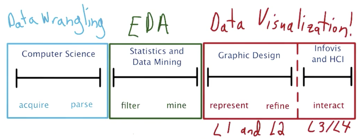
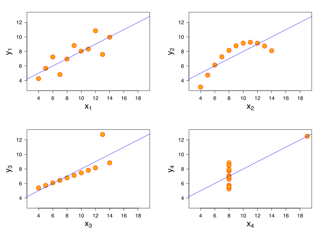
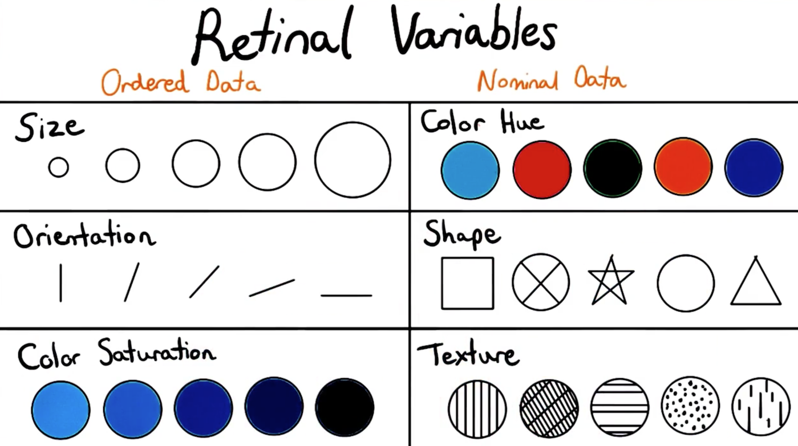
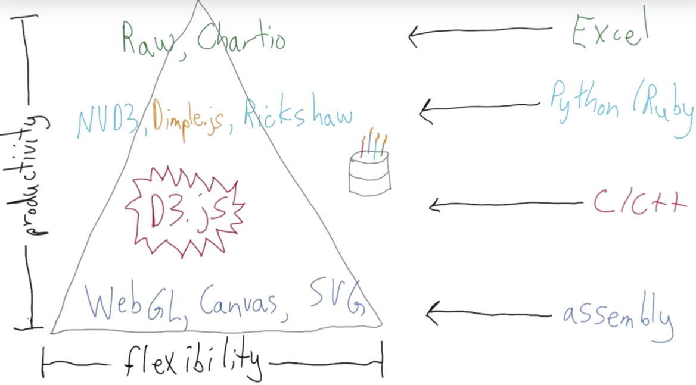
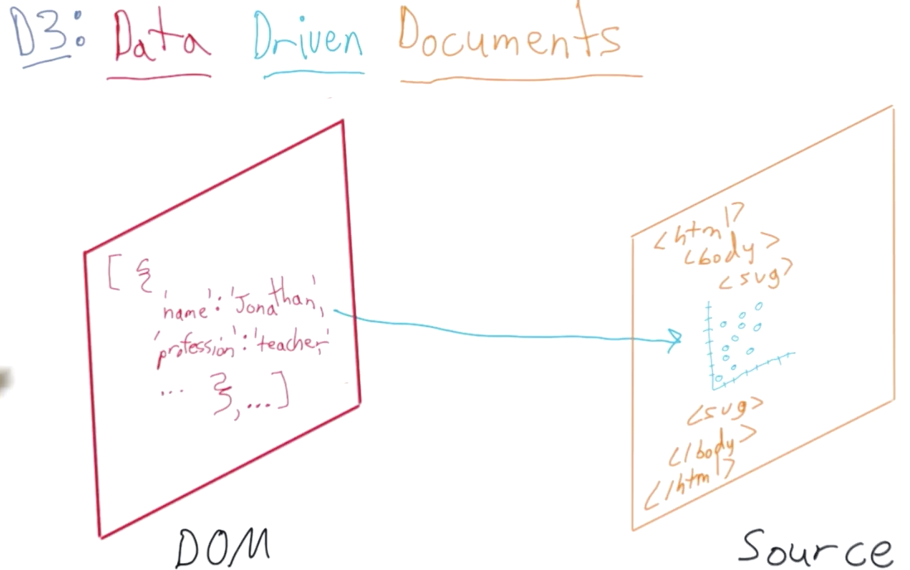
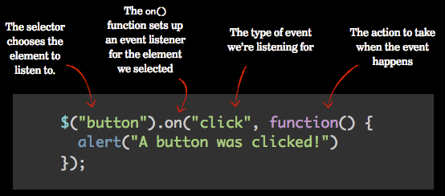

# Data Visualization with d3.js

## Data Visualization

> Data visualization is interactively exploring data, instead of infographics intented to show a predefined fact by data.  [Reference](http://www.thefunctionalart.com/2014/03/infographics-to-reveal-visualizations.html) 
>
> Your greatest insight is only as good as your ability to communicate it.
>
> > Not only accuracy, think about how someone might use your model or derive some value from your analysis.

**Designer // Engineer // Storyteller** : different aspects of data visualization



**PS:** EDA is for the understanding between you and data, while data visualization is for your audience.

### Anscombe's Quartet

Even descriptive results of datasets are same, their patterna can be extremely different.



### Visualization Encodings

#### Data Types Determines Encodings

> Nominal / Ordered / Quantitative data
>
> > Time series data is a special which can be ordered quantitative data



#### Ranking of Visualization Techniques

> Ranked by how accurate when people decoding varied plot elements

1. Position along a common scale e.g. [scatter plot](http://www.b-eye-network.com/view/2468)
2. Position on identical but nonaligned scales e.g. [multiple scatter plots](http://psycnet.apa.org/journals/pas/19/1/images/pas_19_1_88_fig7a.gif)
3. Length e.g. [bar chart](http://flowingdata.com/2009/07/02/whos-going-to-win-nathans-hot-dog-eating-contest/)
4. Angle & Slope (tie) e.g. [pie chart](http://flowingdata.com/2008/06/09/what-do-you-use-to-analyze-andor-visualize-data-poll-results/)
5. Area e.g. [bubbles](http://flowingdata.com/2007/10/02/americans-prefer-watered-down-beer/)
6. Volume, density, and color saturation (tie) e.g. [heatmap](http://flowingdata.com/2010/01/21/how-to-make-a-heatmap-a-quick-and-easy-solution/)
7. Color hue e.g. [newsmap](http://newsmap.jp/)

[Reference](http://flowingdata.com/2010/03/20/graphical-perception-learn-the-fundamentals-first/) 

### Visualization Techniques





> D3 drive DOM to source.
>
> 1. DOM is created during page loaded
> 2. DOM can be accessed through Javascript API
> 3. DOM is a specification and hierarchical object
>
> [Reference of DOM](https://www.w3schools.com/js/js_htmldom.asp) 

## Web Development Basic

- HTML
- DOM (Document Object Model) -- programming interface for HTML, allowing dynamically access and update content, structure and style of HTML in a tree architecture. It defines:
  - The HTML elements as **objects**
  - The **properties** of all HTML elements
  - The **methods** to access all HTML elements
  - The **events** for all HTML elements
- CSS -- style the visual presentation of HTML pages, which is built up by selectors and rules
  - `<style> </style>` 
- JaveScript -- instruct the browser to make changes to a page after loaded, by accessing DOM
  - `<script> </script>` 
- SVG (Scalable Vector Graphics) -- basic visualization elements
  - `<svg> </svg>` 

### HTML


```html
<!-- Essential 1: define using HTML5 -->
<!DOCTYPE html>

<!-- Essential 2: head tag for non-content info -->
<head>
    <!-- title in browser tab -->
  <title>Anna Dowlin</title>
    <!-- css style with selector-rule pair,
	and using [attribute] to select particular element -->
  <style>
    body {
      text-align: center;
      background: url("http://dash.ga.co/assets/anna-bg.png");
      background-size: cover;
      background-position: center;
      color: white;
      font-family: helvetica;
    }
    p {
      font-size: 22px;
    }
    input {
      border: 0;
      padding: 10px;
      font-size: 18px;
    }
    input[type="submit"] {
      background: red;
      color: white;
    }
  </style>
</head>

<!-- Essential 3: body tag for content info -->
<body>
  	<!-- insert image -->
  
  <p>Hi! I'm Anna, a NYC-based marketer. Say hello!</p>
    <!-- type and placeholder are attributes of input -->
  <input type="email" placeholder="Your email">
  <input type="submit">
</body>
```


```html
<!DOCTYPE html>
<head>
  <link href="/normalize.css" rel="stylesheet">
  <style>
    header {
      text-align: center;
      background: url('http://dash.ga.co/assets/jeff-bg.png');
      background-size: cover;
      color: white;
    }
    a {
      color: white;
    }
    h1 {
      font-size: 70px;
    }
    img {
      margin: 40px 0px 0px 0px;
      border: 7px solid white;
      border-radius: 20px;
    }
    ul {
      padding: 10px;
      background: rgba(0,0,0,0.5);
    }
    li {
      display: inline;
      padding: 0px 10px 0px 10px;
    }
    article {
      max-width: 500px;
      padding: 20px;
      margin: 0 auto;
    }
    @media (max-width: 500px) {
      body {
        background: red;
      }
      h1 {
        font-size: 36px;
      }
      li {
        display: block;
        padding: 5px;
      }
    }
  </style>
    <!-- 1. Margin control the space outside the element, while border control the space 			 inside
		 2. @media is a logical operation for the browser properties
		 3. article margin with '0 auto' is that 0 for top/bottom, auto for left/right -->
</head>
<body>
  <header>
    
    <h1>Jeff's Blog</h1>
    <ul>
      <li><a href="#">About Me</a></li>
      <li><a href="#">Best Poems</a></li>
      <li><a href="#">Worst Poems</a></li>
    </ul>
  </header>
  <article>
    <h2>VHS umami pop-up trust fund</h2>
    <p>Marfa church-key kitsch bicycle rights, 8-bit mixtape cardigan gentrify Echo Park. Street art swag brunch, next level roof party Schlitz hella organic keffiyeh selfies. You probably haven't heard of them polaroid hashtag +1, meggings biodiesel Portland High Life cray tumblr retro.</p>
    <button>Like</button>
  </article>
  <article>
    <h2>Sartorial synth Echo Park, roof party</h2>
    <p>chambray you probably haven't heard of them pour-over viral selvage umami skateboard VHS post-ironic selfies. Wes Anderson gentrify fanny pack twee, bicycle rights bitters blog keffiyeh plaid flannel. Tonx irony cliche sustainable mlkshk bitters. Four loko leggings chambray Vice.</p>
    <button>Like</button>
  </article>
  <article>
    <h2>Forage food truck keytar master cleanse</h2>
    <p>ethical thundercats sustainable locavore quinoa Neutra. Aesthetic tacky sweater single-origin coffee, bicycle rights organic lo-fi street art american apparel ennui four loko ethnic Brooklyn small batch. Forage YOLO polaroid</p>
      <!-- Button elements -->
    <button>Like</button>
  </article>
    <!-- JavaScript elements -->
  <script>$("button").on("click",function(){alert("clicked!")})</script>
</body>
```



### JavaScript and DOM

```javascript
// JavaScript Console Operation
// Define a function
function say_hello() {
    return "Hello World!";
};
// Check a function
say_hello;
// Run a function
say_hello();
```

```javascript
// JavaScript DOM Command
// Show items corresponding to HTML
document;
// Show items corresponding to browser window
window;

// Select DOM node/element, by HTML tag, their class or an ID
document.getElementByClassName;
document.getElementById;
// Select DOM node/element, by CSS selector syntax with querySelector
document.querySelector('.main'); // class selector with full stop
document.querySelector('#main'); // ID selector with hash
```

[Intro to CSS Class and ID](http://www.htmldog.com/guides/css/intermediate/classid/) 


## d3 Components

> D3 is a client-side scripting, which can add, delete and change DOM node programmatically 

### Load D3

```javascript
// Way 1: Originally integrated in head tag
// Way 2: Run all source code into JS console
// Way 3: Insert into head tag through JS, as below
var script = document.createElement('script');
script.type = 'text/javascript';
script.src = "https://d3js.org/d3.v5.min.js";
document.head.appendChild(script);
```

### Select D3 Object and Chained Operations

```javascript
// Single selection
d3.select('.navbar'); // using CSS selector syntax, return an array of 1st match
d3.select('.navbar.navbar-inverse'); // with multiple classes
// Nested selection
d3.select('#header-logo img'); // equal to below
d3.select('#header-logo').select('img'); // chain

// Check navbar color with chain
elem.style('background-color');
// Change navbar color with chain
elem.style('background-color', '#757c81'); 
```

### Draw a China Red Dot

#### 1. Create Scale

> D3 is created to translate or map data values to pixel values.


```javascript
// 1. Define Scale


```


## Dimple.js

## Structure of Narrative

## Animation and Interaction

